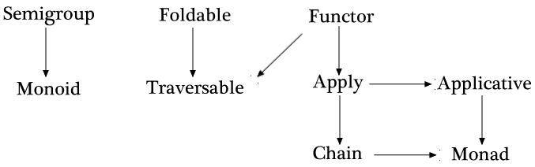

# Simpleton-Algebraics
Learn about Functional Algebraic Types without making your head explode.

This document is essentially a mirror of the Fantasy Land Spec with each
section simplified with less complicated descriptions. It's the version of the
spec that I wish had existed when I first started learning this stuff.

We're going to be talking about the following algebraic types, if you're
interested in the more cranial-explosive version you can read find it in the
[Fantasy Land Spec](https://github.com/fantasyland/fantasy-land#profunctor).

-   [Setoid](#setoid)
-   [Semigroup](#semigroup)
-   [Monoid](#monoid)
-   [Functor](#functor)
-   [Apply](#apply)
-   [Applicative](#applicative)
-   [Foldable](#foldable)
-   [Traversable](#traversable)
-   [Chain](#chain)
-   [Monad](#monad)
-   [Extend](#extend)
-   [Comonad](#comonad)
-   [Bifunctor](#bifunctor)
-   [Profunctor](#profunctor)


# Preface

So to start off, why are you here? Well; you're here to learn about some algebraic types and how
they interact. Why learn algebra? The algebras that follow encapsulate many patterns that pop up
in everyday programming, by formalizing them we can recognize and abstract over them, often using
existing tools and research to make our job easier! Think of this as a kind of a collection of
functional design patterns.

What is an algebra? Basically an algebra is a combination of
three things:

-   A set of values which fit the algebra
-   A set of operations or functions you can perform on the values. There's a
    requirement that any operation for an algebra MUST result in a new value
    that is part of the algebra. For example if the valid values of your
    algebra is the set of all numbers, then `x => x + 1` could be an operation
    because it always results in a number (which is part of our algebra), but
    `x => toString(x)` couldn't be an operation in our algebra because it
    results in a string which isn't a number.
-   A set of laws which the algebra must obey


Each of the algebraic types we specify below can stand on their own except
where they specify dependencies on other types. You can see the dependencies in
the figure below.



## Terminology

Since we have a lot to talk about yet, we should probably clarify our terms a
bit so we're all on the same page. Let's take a look at what we'll be working
with.

1.  A **value** is any of the following:
    -   A **number**
    -   A **string**
    -   An **object**: which consists of keys which are strings and values
        which are any of our value types
    -   A **list**: which contains a bunch of ordered values

We'll also be using some notation to express ideas; the basic notation follows
the Hindley Milner type system which sounds scary, but it's really not! It's the
same notation languages like Haskell use for their type annotations. Here's an example:

```haskell
map :: (a -> b) -> [a] -> [b]
```

This reads as: The function `map` takes an argument of type `(a -> b)` and a list of objects of type `a`
and returns a list of objects of type `b`.

We notice that the bracketed `(a -> b)` makes this function signature mean differently than `a -> b -> [a] -> [b]`
which takes an `a`, a `b` and a list of `a`s and returns a list of `b`s.

Since we're using instance methods here rather than just functions the object we're operating on will come first, so
we'd write map as:

```haskell
map :: [a] ~> (a -> b) -> [b]
```

One last thing; if you see something like: `Monoid m => [m] -> m` it means that in order for the function to work
`m` has to have a `Monoid` defined!

And off we go! Let's take a look at some of our algebras.

## Algebras

For each of the following algebras we'll list the following:

-   Rules: Each algebra has to behave in a certain way for it to be useful.
-   Required operations: These are a set of functions or behaviours which must
    be defined for your algebra for it to fit the given class. How you define
    them is your choice, so long as each operation also follows its set of
    rules!


# Setoid

Required operations: `equals`

## Rules

Anything that wants to call itself a Setoid must behave according to these
rules. For a Setoid the rules we care about all have to do with the `equals`
operation.

### Identity Crisis

The first rule is that if we check whether a thing `equals` itself then it
better say yes! for instance if my dog Rover is a Setoid then
`Rover.equals(Rover)` should be `true`! The bean counters in the lab call this
nifty trick *Reflexivity*, the shorthand for it is `a.equals(a) === true`.

### The Flip-Flop

The second rule is that if we check whether `A.equals(B)`, then we better get
the same answer as when we check if `B.equals(A)`. Let's say I get sick of
calling my dog Rover and I nick-name him Scrappy instead. Well since
`Rover.equals(Scrappy)` it better also be true that `Scrappy.equals(Rover)`!
The same goes for things that aren't equal, so since `Apple.equals(Orange)` is
false, then so is `Orange.equals(Apple)`. The fancy-schmancy word for this is
*Symmetry*, and the shorthand goes like this: `a.equals(b) === b.equals(a)`

### Follow the dots

The last rule of Setoids goes like this; if `A.equals(B)` and `B.equals(C)` are
both true, then `A.equals(C)` better also be true! This makes sense if you think about it,
if you've got three friends; if Alex and Brian are identical to each other, and Brian and Charlie are identical to each
other, then we know Alex and Charlie are identical too! Looks like we've got a set of triplets!

When you can follow a chain of `equals` to find new information we say that
`equals` is *Transitive*.

## Methods

### `equals`

```hs
equals :: Setoid a => a ~> a -> Boolean
```

A value which has a Setoid must provide an `equals` method. The
`equals` method takes one argument:

    a.equals(b)

1. `b` must be a value of the same Setoid

    1. If `b` is not the same Setoid, behaviour of `equals` is
       unspecified (returning `false` is recommended).

2. `equals` must return a boolean (`true` or `false`).

# Semigroup

1. `a.concat(b).concat(c)` is equivalent to `a.concat(b.concat(c))` (associativity)

#### `concat` method

```hs
concat :: Semigroup a => a ~> a -> a
```

A value which has a Semigroup must provide a `concat` method. The
`concat` method takes one argument:

    s.concat(b)

1. `b` must be a value of the same Semigroup

    1. If `b` is not the same semigroup, behaviour of `concat` is
       unspecified.

2. `concat` must return a value of the same Semigroup.

### Monoid

A value that implements the Monoid specification must also implement
the Semigroup specification.

1. `m.concat(m.empty())` is equivalent to `m` (right identity)
2. `m.empty().concat(m)` is equivalent to `m` (left identity)

#### `empty` method

```hs
empty :: Monoid m => () -> m
```

A value which has a Monoid must provide an `empty` method on itself or
its `constructor` object. The `empty` method takes no arguments:

    m.empty()
    m.constructor.empty()

1. `empty` must return a value of the same Monoid

### Functor

1. `u.map(a => a)` is equivalent to `u` (identity)
2. `u.map(x => f(g(x)))` is equivalent to `u.map(g).map(f)` (composition)

#### `map` method

```hs
map :: Functor f => f a ~> (a -> b) -> f b
```

A value which has a Functor must provide a `map` method. The `map`
method takes one argument:

    u.map(f)

1. `f` must be a function,

    1. If `f` is not a function, the behaviour of `map` is
       unspecified.
    2. `f` can return any value.

2. `map` must return a value of the same Functor

### Apply

A value that implements the Apply specification must also
implement the Functor specification.

1. `a.map(f => g => x => f(g(x))).ap(u).ap(v)` is equivalent to `a.ap(u.ap(v))` (composition)

#### `ap` method

```hs
ap :: Apply f => f (a -> b) ~> f a -> f b
```

A value which has an Apply must provide an `ap` method. The `ap`
method takes one argument:

    a.ap(b)

1. `a` must be an Apply of a function,

    1. If `a` does not represent a function, the behaviour of `ap` is
       unspecified.

2. `b` must be an Apply of any value

3. `ap` must apply the function in Apply `a` to the value in
   Apply `b`

### Applicative

A value that implements the Applicative specification must also
implement the Apply specification.

1. `a.of(x => x).ap(v)` is equivalent to `v` (identity)
2. `a.of(f).ap(a.of(x))` is equivalent to `a.of(f(x))` (homomorphism)
3. `u.ap(a.of(y))` is equivalent to `a.of(f => f(y)).ap(u)` (interchange)

#### `of` method

```hs
of :: Applicative f => a -> f a
```

A value which has an Applicative must provide an `of` method on itself
or its `constructor` object. The `of` method takes one argument:

    a.of(b)
    a.constructor.of(b)

1. `of` must provide a value of the same Applicative

    1. No parts of `b` should be checked

### Foldable

1. `u.reduce` is equivalent to `u.reduce((acc, x) => acc.concat([x]), []).reduce`

#### `reduce` method

```hs
reduce :: Foldable f => f a ~> (b -> a -> b) -> b -> b
```

A value which has a Foldable must provide a `reduce` method. The `reduce`
method takes two arguments:

    u.reduce(f, x)

1. `f` must be a binary function

    1. if `f` is not a function, the behaviour of `reduce` is unspecified.
    2. The first argument to `f` must be the same type as `x`.
    3. `f` must return a value of the same type as `x`

1. `x` is the initial accumulator value for the reduction

### Traversable

A value that implements the Traversable specification must also
implement the Functor and Foldable specifications.

1. `t(u.sequence(f.of))` is equivalent to `u.map(t).sequence(g.of)`
for any `t` such that `t(a).map(f)` is equivalent to `t(a.map(f))` (naturality)

2. `u.map(F.of).sequence(F.of)` is equivalent to `F.of(u)` for any Applicative `F` (identity)

3. `u.map(x => new Compose(x)).sequence(Compose.of)` is equivalent to
   `new Compose(u.sequence(F.of).map(v => v.sequence(G.of)))` for `Compose` defined below and any Applicatives `F` and `G` (composition)

```js
var Compose = function(c) {
  this.c = c;
};

Compose.of = function(x) {
  return new Compose(F.of(G.of(x)));
};

Compose.prototype.ap = function(x) {
  return new Compose(this.c.map(u => y => u.ap(y)).ap(x.c));
};

Compose.prototype.map = function(f) {
  return new Compose(this.c.map(y => y.map(f)));
};
```

#### `sequence` method

```hs
sequence :: Apply f, Traversable t => t (f a) ~> (b -> f b) -> f (t a)
```

A value which has a Traversable must provide a `sequence` method. The `sequence`
method takes one argument:

    u.sequence(of)

1. `of` must return the Applicative that `u` contains.

### Chain

A value that implements the Chain specification must also
implement the Apply specification.

1. `m.chain(f).chain(g)` is equivalent to `m.chain(x => f(x).chain(g))` (associativity)

#### `chain` method

```hs
chain :: Chain m => m a ~> (a -> m b) -> m b
```

A value which has a Chain must provide a `chain` method. The `chain`
method takes one argument:

    m.chain(f)

1. `f` must be a function which returns a value

    1. If `f` is not a function, the behaviour of `chain` is
       unspecified.
    2. `f` must return a value of the same Chain

2. `chain` must return a value of the same Chain

### Monad

A value that implements the Monad specification must also implement
the Applicative and Chain specifications.

1. `m.of(a).chain(f)` is equivalent to `f(a)` (left identity)
2. `m.chain(m.of)` is equivalent to `m` (right identity)

### Extend

1. `w.extend(g).extend(f)` is equivalent to `w.extend(_w => f(_w.extend(g)))`

#### `extend` method

```hs
extend :: Extend w => w a ~> (w a -> b) -> w b
```

An Extend must provide an `extend` method. The `extend`
method takes one argument:

     w.extend(f)

1. `f` must be a function which returns a value

    1. If `f` is not a function, the behaviour of `extend` is
       unspecified.
    2. `f` must return a value of type `v`, for some variable `v` contained in `w`.

2. `extend` must return a value of the same Extend.

### Comonad

A value that implements the Comonad specification must also implement the Functor and Extend specifications.

1. `w.extend(_w => _w.extract())` is equivalent to `w`
2. `w.extend(f).extract()` is equivalent to `f(w)`
3. `w.extend(f)` is equivalent to `w.extend(x => x).map(f)`

#### `extract` method

```hs
extract :: Comonad w => w a ~> () -> a
```

A value which has a Comonad must provide an `extract` method on itself.
The `extract` method takes no arguments:

    c.extract()

1. `extract` must return a value of type `v`, for some variable `v` contained in `w`.
    1. `v` must have the same type that `f` returns in `extend`.

### Bifunctor

A value that implements the Bifunctor specification must also implement
the Functor specification.

1. `p.bimap(a => a, b => b)` is equivalent to `p` (identity)
2. `p.bimap(a => f(g(a)), b => h(i(b))` is equivalent to `p.bimap(g, i).bimap(f, h)` (composition)

#### `bimap` method

```hs
bimap :: Bifunctor f => f a c ~> (a -> b) -> (c -> d) -> f b d
```

A value which has a Bifunctor must provide an `bimap` method. The `bimap`
method takes two arguments:

    c.bimap(f, g)

1. `f` must be a function which returns a value

    1. If `f` is not a function, the behaviour of `bimap` is unspecified.
    2. `f` can return any value.

2. `g` must be a function which returns a value

    1. If `g` is not a function, the behaviour of `bimap` is unspecified.
    2. `g` can return any value.

3. `bimap` must return a value of the same Bifunctor.

### Profunctor

A value that implements the Profunctor specification must also implement
the Functor specification.

1. `p.promap(a => a, b => b)` is equivalent to `p` (identity)
2. `p.promap(a => f(g(a)), b => h(i(b)))` is equivalent to `p.promap(f, i).promap(g, h)` (composition)

#### `promap` method

```hs
promap :: Profunctor p => p b c ~> (a -> b) -> (c -> d) -> p a d
```

A value which has a Profunctor must provide a `promap` method.

The `profunctor` method takes two arguments:

    c.promap(f, g)

1. `f` must be a function which returns a value

    1. If `f` is not a function, the behaviour of `promap` is unspecified.
    2. `f` can return any value.

2. `g` must be a function which returns a value
  
    1. If `g` is not a function, the behaviour of `promap` is unspecified.
    2. `g` can return any value.

3. `promap` must return a value of the same Profunctor

## Derivations

When creating data types which satisfy multiple algebras, authors may choose
to implement certain methods then derive the remaining methods. Derivations:

  - [`map`][] may be derived from [`ap`][] and [`of`][]:

    ```js
    function(f) { return this.of(f).ap(this); }
    ```

  - [`map`][] may be derived from [`chain`][] and [`of`][]:

    ```js
    function(f) { var m = this; return m.chain(a => m.of(f(a))); }
    ```

  - [`map`][] may be derived from [`bimap`]:
  
    ```js
    function(f) { return this.bimap(a => a, f); }
    ```

  - [`map`][] may be derived from [`promap`]:

    ```js
    function(f) { return this.promap(a => a, f); }
    ```

  - [`ap`][] may be derived from [`chain`][]:

    ```js
    function(m) { return this.chain(f => m.map(f)); }
    ```

  - [`reduce`][] may be derived as follows:

    ```js
    function(f, acc) {
      function Const(value) {
        this.value = value;
      }
      Const.of = function(_) {
        return new Const(acc);
      };
      Const.prototype.map = function(_) {
        return this;
      };
      Const.prototype.ap = function(b) {
        return new Const(f(this.value, b.value));
      };
      return this.map(x => new Const(x)).sequence(Const.of).value;
    }
    ```

If a data type provides a method which *could* be derived, its behaviour must
be equivalent to that of the derivation (or derivations).

## Notes

1. If there's more than a single way to implement the methods and
   laws, the implementation should choose one and provide wrappers for
   other uses.
2. It's discouraged to overload the specified methods. It can easily
   result in broken and buggy behaviour.
3. It is recommended to throw an exception on unspecified behaviour.
4. An `Id` container which implements all methods is provided in
   `id.js`.


[`ap`]: #ap-method
[`bimap`]: #bimap-method
[`chain`]: #chain-method
[`concat`]: #concat-method
[`empty`]: #empty-method
[`equals`]: #equals-method
[`extend`]: #extend-method
[`extract`]: #extract-method
[`map`]: #map-method
[`of`]: #of-method
[`promap`]: #promap-method
[`reduce`]: #reduce-method
[`sequence`]: #sequence-method

## Alternatives

There also exists [Static Land Specification](https://github.com/rpominov/static-land)
with the exactly same ideas as Fantasy Land but based on static methods instead of instance methods.
